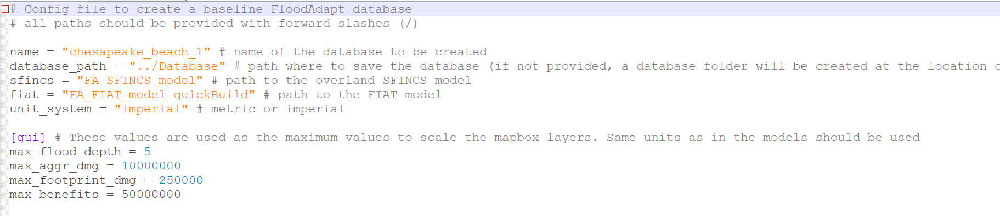

---
title:	Database Builder
filters:
  - lightbox
lightbox: auto
---
 The FloodAdapt database builder is intended to greatly simplify the process of setting up FloodAdapt in a new location. The FloodAdapt software is an 'empty shell' that must be connected to a site-specific database. The database builder aids the user in setting up this database. 
 
 The most critical components of the FloodAdapt database are the SFINCS and Delft-FIAT models, both of which can now be generated with greater ease using the [SFINCS model-builder](SFINCS/index.qmd) and the [Delft-FIAT model-builder](Delft_Fiat/index.qmd). Once these have been created, users can run the FloodAdapt database builder to generate a complete database for a functioning FloodAdapt application at their site. 

 Running the database builder simply requires double-clicking the FloodAdapt database-builder executable. This opens a screen where the user can enter a file path to the database-builder configuration file. 

 This documentation will describe the FloodAdapt database-builder configuration file. Depending on the amount of information included in the configuration file, different FloodAdapt functionalities will be activated. This is described in the section [FloodAdapt capabilities based on configuration](#floodadapt-capabilities-based-on-configuration). It starts by outlining the minimum information required to generate a functional FloodAdapt system, and then specifies additional functionalities and the required information in the configuration file to activate them. The section [Configuration file attributes](#configuration-file-attributes) specifies all of the attributes that can be included in the database-builder configuration and details about their format and use. 

## FloodAdapt capabilities based on configuration
There are different functionalities that are activiated in FloodAdapt depending on the information contained in the configuration file. This section starts by describing the information needed for the [baseline FloodAdapt configuration](#baseline-floodadapt-configuration), which is the minimum needed to set up a functional FloodAdapt system. Note that an important requirement is that a Delft-FIAT model and an overland SFINCS model have been set up for the site. The following sections then describe additional FloodAdapt functionality that is activated with additional configuration input. 

### Baseline FloodAdapt configuration
A baseline FloodAdapt configuration is a functional version of FloodAdapt that requires the minimum amount of configuration input. This version allows users to run event scenarios for either a synthetic event or a historical gauged event. All measures and future projections are available for analysis. Note that because it only supports event scenarios, the risk and benefits options are not available for this baseline configuration.

The information needed to set up a baseline FloodAdapt configuration are:

* A name for your site
* The path to your overland SFINCS model folder
* The path to your Delft-FIAT model folder
* The unit system you want to work in (imperial or metric)
* Max values for mapping bins

A screenshot of an example configuration file for a baseline FloodAdapt model for Chesapeake Beach is shown in @fig-DB_baseline

{width=70% fig-align=left #fig-DB_baseline}

### Simulating hurricane events
To add the ability to simulate a scenario with a historical hurricane, the user needs an offshore SFINCS model, which can also be created with the [SFINCS model-builder](SFINCS/index.qmd). Many offshore SFINCS models have been created for the U.S. East and Gulf coasts and may be available for use at no cost. 
[ADD FIGURE SHOWING THE ADD EVENT POPUP WITH ONLY TWO EVENTS ON LEFT AND ON RIGHT A VERSION THAT INCLUDES THE HURRICANE]

### Downloading historical water levels
[ADD FIGURE SHOWING THE GAUGED EVENT WITH NO DOWNLOAD-WATER-LEVEL BUTTON]

### Social vulnerability insights

### Visualizing water level output time series

### Elevating buildings above base flood elevation (BFE)

### Sea level rise scenario selection

## Configuration file attributes