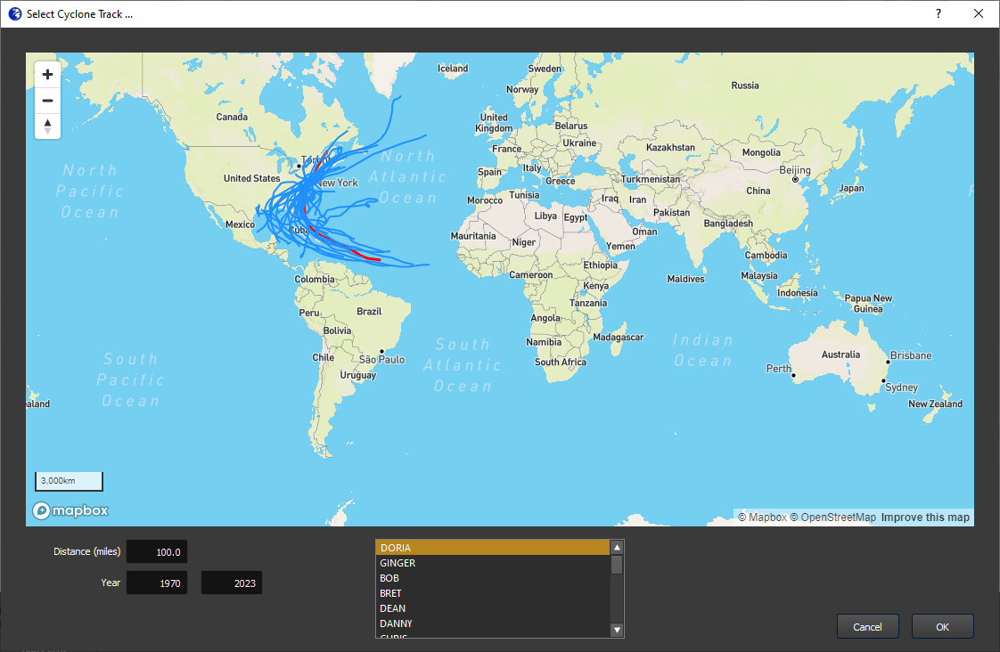
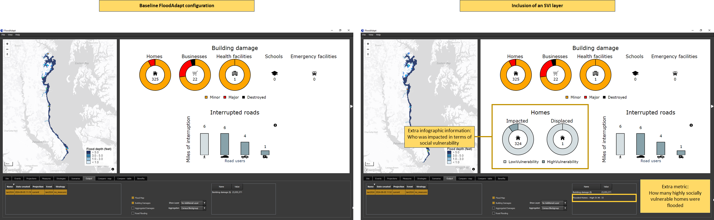
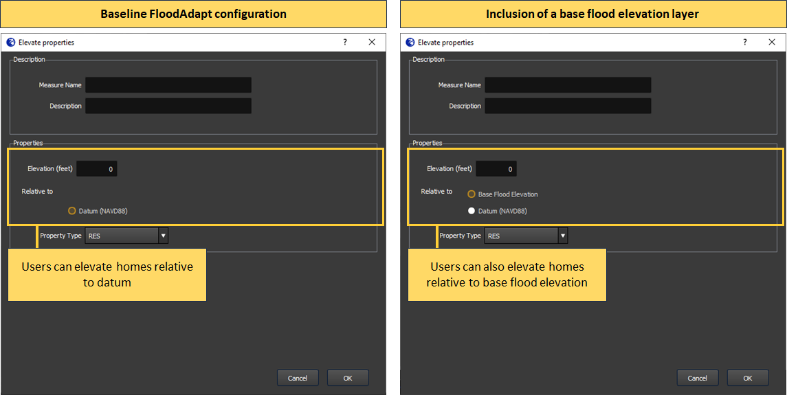
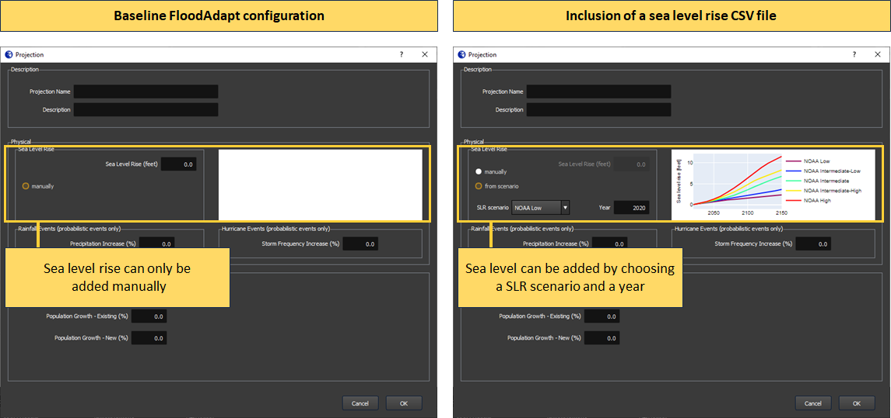

To get started with FloodAdapt in a new location, a site-specific FloodAdapt database needs to be created. To support users in the creation of this database, FloodAdapt includes a **database builder**. The database builder is available as a Python API. For a complete, step-by-step walkthrough of every configuration option, see the [Database Builder (Python) example](../3_api_docs/examples/database_builder/database_builder.ipynb). This page describes the information the database builder needs and the FloodAdapt functionalities that each piece of information activates.

::: {.callout-tip}
#### SFINCS and Delft-FIAT models
Two important components of a FloodAdapt database are the flood and impact models: a SFINCS overland model (and, optionally, a SFINCS offshore model) and a Delft-FIAT impact model. These models are prepared outside of FloodAdapt, and the database builder assumes they have already been created.

The recommended way to build these models is with the HydroMT model builders:

* **SFINCS models** with [HydroMT-SFINCS](https://deltares.github.io/hydromt_sfincs/). FloodAdapt is tested with `hydromt-sfincs >=1.2.2,<2.0`.
* **Delft-FIAT models** with [HydroMT-FIAT](https://deltares.github.io/hydromt_fiat/). FloodAdapt is tested with `hydromt-fiat >=0.5.10,<1.0`.

FloodAdapt runs these models using the SFINCS and Delft-FIAT executables (model kernels). The current release works with the [SFINCS](https://sfincs.readthedocs.io/en/v2.1.1_dollerup_release/overview.html) `v2.1.1-Dollerup` executable and the [Delft-FIAT](https://deltares.github.io/Delft-FIAT/v0.2.1/) `v0.2.1` executable.
:::

The FloodAdapt database-builder is intended to greatly simplify the process of setting up FloodAdapt in a new location. The FloodAdapt software is an 'empty shell' that must be connected to a site-specific database. The database-builder aids the user in setting up this database.

The most critical components of the FloodAdapt database are the SFINCS and Delft-FIAT models, both of which can be generated with the [HydroMT-SFINCS](https://deltares.github.io/hydromt_sfincs/) and [HydroMT-FIAT](https://deltares.github.io/hydromt_fiat/) model builders. Once these have been created, users can run the FloodAdapt database-builder to generate a complete database for a functioning FloodAdapt application at their site. See the [Database Builder (Python) example](../3_api_docs/examples/database_builder/database_builder.ipynb) for a worked example.

This documentation describes the different pieces of information the database builder can use. Depending on the amount of information provided, different FloodAdapt functionalities will be activated. This is described in the section [FloodAdapt capabilities based on configuration](#floodadapt-capabilities-based-on-configuration). It starts by outlining the minimum information required to generate a functional FloodAdapt system, and then specifies additional functionalities and the information required to activate them.

## FloodAdapt capabilities based on configuration
There are different functionalities that are activated in FloodAdapt depending on the information provided to the database builder. This section starts by describing the information needed for the [baseline FloodAdapt configuration](#baseline-floodadapt-configuration), which is the minimum needed to set up a functional FloodAdapt system. Note that an important requirement is that a Delft-FIAT model and an overland SFINCS model have been set up for the site. The subsequent sections then describe additional FloodAdapt functionality that is activated with additional configuration input.

### Baseline FloodAdapt configuration
A baseline FloodAdapt configuration is a functional version of FloodAdapt that requires the minimum amount of configuration input. This version allows users to run event scenarios for either a synthetic event or a historical gauged event. All measures and future projections are available for analysis. Note that because it only supports event scenarios, the risk and benefits options are not available for this baseline configuration.

A baseline FloodAdapt configuration allows users to get started with FloodAdapt with relatively little required information. The following is all that is required for a baseline configuration:

* A name for your site
* The path to your overland SFINCS model folder
* The path to your Delft-FIAT model folder
* The unit system you want to work in (imperial or metric)
* Max values for output maps displayed in the FloodAdapt user interface

::: {.callout-tip}
#### Specifying the baseline configuration in the database builder
The name of your site, the paths to your SFINCS and Delft-FIAT models, and the unit system are set with the `name`, `database_path`, `sfincs_overland`, `fiat`, and `unit_system` attributes of the database builder configuration. The max values for output maps are set with the `gui` attribute. See the [Database Builder (Python) example](../3_api_docs/examples/database_builder/database_builder.ipynb) for details and code.
:::

### Risk and benefit analysis
The baseline FloodAdapt configuration allows users to simulate event scenarios, which can be very insightful. However, risk scenarios allow users to understand the current and future risk to a community (considering many types of events), with and without adaptation options, and to calculate the risk-reduction benefits of adaptation strategies. To activate the risk scenario and benefit analysis functionality, a [probabilistic event set](risk_analysis.qmd) is required. When this set is included in the FloodAdapt database, FloodAdapt can calculate the flooding for all the events in the set and uses a probabilistic calculator to calculate return period flooding, impacts, and risk.

<!-- :: {.callout-note}
#### What is the difference between an event scenario and a risk scenario
For an event scenario FloodAdapt calculates the flooding and impacts for one single weather event, such as a hurricane or a king tide with rainfall. The scenario can include future projections and measures, but always represents just one single event. For a risk scenario, in contrast, FloodAdapt calculates flooding for a set of events with different probabilities. From this output, FloodAdapt derives return period flood maps (such as the 10-year, 25-year, or 100-year flood maps) and return period damage maps. It then combines this information to further derive *expected annual damages*, which is the metric associated with economic risk.
:::-->

::: {.callout-tip}
#### Including a probabilistic event set in the database builder
A probabilistic event set is specified with the `probabilistic_set` attribute of the database builder configuration (the return periods to be calculated can be set with `return_periods`). See the [Database Builder (Python) example](../3_api_docs/examples/database_builder/database_builder.ipynb) for details and code.
:::

### Simulating hurricane events and 'ungauged' historical events
For FloodAdapt users to simulate a scenario with a historical hurricane, or to simulate a historical event for which there are no measured nearshore water levels, an offshore SFINCS model needs to be included in the FloodAdapt database (this can be created with [HydroMT-SFINCS](https://deltares.github.io/hydromt_sfincs/)). Once an offshore model is included, users will see additional event types that can be selected when they click "Add Event" in the FloodAdapt Events tab (see @fig-DB_offshore). If a specific cyclone basin is specified in the database builder configuration, only hurricanes in the specified basin will be included in the database and displayed in the hurricane selector window (which appears when the 'Historical - hurricane' option is chosen); see @fig-DB_cyclonesNA. Note that if hurricanes are not relevant in an area, but an offshore model is included to simulate ungauged historical events, the hurricane event option can be "turned off" in the database builder configuration.
<!-- Many offshore SFINCS models have been created for the U.S. East and Gulf coasts and may be available for use at no cost
In addition to specifying an offshore model, the user can also indicate which 'cyclone basin' is relevant for them. @fig-DB_cyclonesNA shows the hurricane selection window for the example of choosing "North America" as the cyclone basin.-->

{width=70% fig-align=left #fig-DB_offshore}

{width=70% fig-align=left #fig-DB_cyclonesNA}

::: {.callout-tip}
#### Including an offshore model and cyclone basin in the database builder
An offshore SFINCS model and a cyclone basin are specified with the `sfincs_offshore`, `cyclones`, and `cyclone_basin` attributes of the database builder configuration. See the [Database Builder (Python) example](../3_api_docs/examples/database_builder/database_builder.ipynb) for details and code.
:::
### Downloading historical water levels
FloodAdapt allows users to simulate historical events. In the baseline FloodAdapt configuration, FloodAdapt users need to import their own water level time series for historical events. When a tide gauge (or alternatively a long time series CSV file) is added to the FloodAdapt database, this activates a 'Download Observed Water Levels' button in the specification window for a historical event. FloodAdapt users can then easily download water levels for a historical event by selecting a start and end date and clicking that button. @fig-DB_comp_tideGauge shows the baseline FloodAdapt configuration on the left and with the inclusion of a tide gauge on the right. For sites in the U.S. tide gauges can be added automatically based on the site location via the [NOAA COOPS](https://tidesandcurrents.noaa.gov/stations.html) website. The NOAA site also includes datum differences at gauge locations, so that users have the option to view water levels relative to a (potentially) more familiar datum (see @fig-DB_comp_tideGauge).

{width=70% fig-align=left #fig-DB_comp_tideGauge}

::: {.callout-tip}
#### Including a tide gauge in the database builder
A tide gauge (or a long water level time series) is added with the `tide_gauge` attribute of the database builder configuration, which activates the 'Download Observed Water Levels' button. See the [Database Builder (Python) example](../3_api_docs/examples/database_builder/database_builder.ipynb) for details and code.
:::
### Social vulnerability insights

FloodAdapt automatically generates an infographic and a metrics table which helps FloodAdapt users understand the impacts of a simulated scenario. Social vulnerability is based on a collection of socio-economic attributes that indicate a longer or harder recovery from a flood event. When a social vulnerability index (SVI) layer is included in the FloodAdapt database, FloodAdapt shows additional information in the infographic and metrics table related to how socially vulnerable people are affected in a simulated scenario. Users can also view the SVI layer in both the [Measures](../1_user_guide/measures/index.qmd) and [Output](../1_user_guide/output/index.qmd) tabs, helping to identify where to explore measures and understand the impacts to socially vulnerable people.  @fig-DB_SVI_comp highlights the added information in the infographic and metrics table. It shows the baseline configuration on the left, and the configuration with an SVI layer added on the right. With the SVI layer included, users can see in the infographic the proportion of highly-vulnerable residential buildings that were damaged and destroyed. In the metrics table, they can see how many highly vulnerable residential properties were flooded.

{width=100% fig-align=left #fig-DB_SVI_comp}

::: {.callout-tip}
#### Including an SVI layer in the database builder
An SVI layer is added with the `svi` attribute of the database builder configuration (which takes the file path, the field name, and a vulnerability threshold). See the [Database Builder (Python) example](../3_api_docs/examples/database_builder/database_builder.ipynb) for details and code.
:::

### Visualizing water level output time series
FloodAdapt allows users to view modeled water level time series at observation points in the FloodAdapt [Output tab](../1_user_guide/output/index.qmd). The spatial flood map in the FloodAdapt Output tab is static and represents the maximum flood depth during an event. Having observation points helps users understand how the water levels evolved *during* an event. To activate this functionality, observation points can be added to the database-builder configuration.

. The left window shows the baseline FloodAdapt configuration, and the right shows with the addition of observation points.**](../_static/images/database_obsComp.png){width=100% fig-align=left #fig-DB_obscomp}

::: {.callout-tip}
#### Including observation points in the database builder
Observation points are added with the `obs_point` attribute of the database builder configuration (a list of points, each with a name, latitude, and longitude). See the [Database Builder (Python) example](../3_api_docs/examples/database_builder/database_builder.ipynb) for details and code.
:::

### Elevating buildings above base flood elevation (BFE)
FloodAdapt allows users to explore home elevations as an adaptation measure. With the base configuration, FloodAdapt users can specify how high a home should be elevated relative to a datum. However, in the U.S. standards for home elevations or elevations of new buildings are often specified relative to *base flood elevation* (BFE). This is a regulatory 100-year flood level calculated by the federal government. When a base flood elevation layer is included in the database builder configuration, FloodAdapt users can choose to elevate homes above a datum or to a height above BFE.

::: {.callout-tip}
#### Including a BFE layer in the database builder
A BFE layer is added with the `bfe` attribute of the database builder configuration (which takes the file path and the field name). See the [Database Builder (Python) example](../3_api_docs/examples/database_builder/database_builder.ipynb) for details and code.
:::

{width=100% fig-align=left #fig-DB_obscomp}

### Sea level rise scenario selection
FloodAdapt allows users to explore the flooding and impacts for future sea level rise projections. In the base configuration case, users have access to this functionality, and can enter a sea level rise explicitly, for example "0.5 feet". However, FloodAdapt users may want to explore flooding and impacts at a specific point in the future, for example in 15 or 20 years, and they may not know the sea level rise to expect in that future year. To facilitate these users, a sea level rise scenario CSV file can be included in the database setup. There are many sources for sea level rise scenarios, such as the [interagency sea level task force](https://sealevel.globalchange.gov/resources/2022-sea-level-rise-technical-report/). There is no limit to the number of SLR scenarios a user can include. FloodAdapt uses this file to generate a visualization showing the different SLR scenario curves in the [Projections](../1_user_guide/projections/index.qmd) selection window. It also allows a user to enter a future year and select a SLR scenario, and then automatically calculates the sea level rise for that year.

::: {.callout-tip}
#### Including SLR scenarios in the database builder
SLR scenarios are added with the `slr_scenarios` attribute of the database builder configuration (which takes the path to a scenarios CSV file and the year the projections are relative to). See the [Database Builder (Python) example](../3_api_docs/examples/database_builder/database_builder.ipynb) for details and code.
:::

{width=100% fig-align=left #fig-DB_slrComp}

::: {.callout-note}
#### What about when sea level rise scenarios change?
Sea level rise scenarios are updating every few years. Updating the sea level rise scenarios in FloodAdapt is a simple as updating the CSV file with the years and projected sea level rise. FloodAdapt will then automatically use the new information when a FloodAdapt user selects a future year and a sea level rise scenario.
:::
